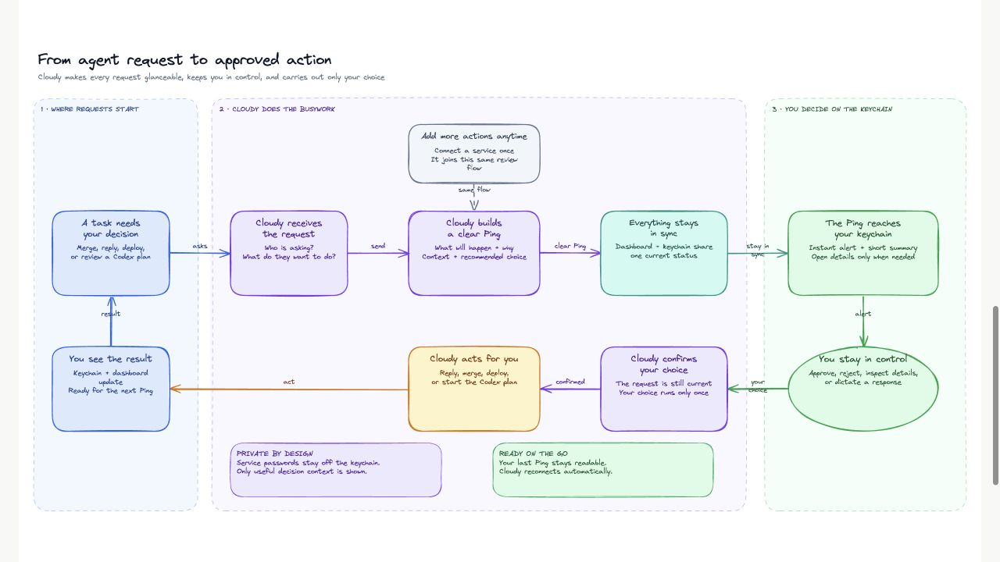
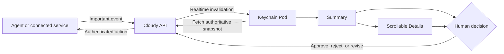

  

<h1 align="center">Cloudy</h1>

  <strong>Your agents keep working. Cloudy brings the decisions to you.</strong>

  An AI-powered keychain companion for reviewing, revising, approving, and rejecting important actions without opening your laptop or phone.

  

## The idea

AI agents can work for minutes or hours on their own, but they still pause when
they need a human decision. Most of those decisions take only a few seconds:
approve a plan, merge a pull request, send a drafted reply, or roll back a bad
deployment. The slow part is not deciding. It is reaching the controls. With a
laptop, you have to carry it everywhere, open it, find the right tab, and
approve, which feels like bringing a bazooka to kill a mosquito. With a phone,
you still have to pull it out, unlock it, open the app, find the request, and
approve. That is a lot of ceremony for decisions that can usually be made at a
glance.

Cloudy turns those moments into clear, glanceable **Pings** on a small physical
companion. It prepares the context, recommends the next action, and keeps the
human in control of anything important.

## What Cloudy does

- Collects approval requests from agents and connected services.
- Shows a calm summary first instead of a wall of raw data.
- Keeps the complete evidence and plan available on a scrollable Details page.
- Lets the user approve, reject, navigate, or dictate a revision from the Pod.
- Sends decisions back through authenticated, hash-bound API paths.
- Receives updates in realtime and keeps cached context available when offline.

Cloudy is not another notification screen. It is a compact decision surface for
human-in-the-loop work.

## Demo moments

| Moment | What Cloudy shows | What the user can do |
| --- | --- | --- |
| **Codex plan** | A six-line summary of a proposed workspace-role database migration, with the full plan in Details | Approve, reject, or dictate a revision |
| **Gmail reply** | Aniket's complete email and the exact drafted response | Review the thread, scroll through Details, and approve or discard the reply |
| **GitHub pull request** | Checks, reviews, risk, rollback, and the reviewed change | Approve or reject the merge decision |
| **Deployment incident** | Canary errors, customer impact, and a recommended rollback | Approve the rollback or leave traffic unchanged |
| **General Ping** | A concise operational alert with the action it will trigger | Acknowledge or reject the recommended action |

## The physical experience

The current prototype combines a **Raspberry Pi Zero 2 W** with a **2.8-inch
240x320 SPI touchscreen** using an ILI9341-compatible display controller and an
XPT2046-compatible touch controller.

The Pod interface renders directly to the Linux framebuffer for a crisp,
low-overhead display. Its interaction model stays deliberately small:

- Swipe left and right to move between connected feeds.
- Swipe up to open Details and swipe down to return to the summary.
- Scroll up and down through long evidence, plans, and email threads.
- Approve or reject with explicit controls.
- Hold both physical buttons to dictate a revision to a Codex plan.

Distinct animations confirm approved and rejected decisions before Cloudy
returns to idle.

## How a decision moves through Cloudy

Events are wake-up signals only. The Pod always fetches the authoritative
snapshot before rendering a decision. Approvals and rejections travel over
normal authenticated HTTP requests rather than being embedded in realtime
messages.

## System architecture

Cloudy is a monorepo with four focused applications:

| Component | Role |
| --- | --- |
| [`apps/pod`](apps/pod) | Python and Pygame runtime for the physical Pod, framebuffer display, touch, buttons, voice capture, caching, and realtime recovery |
| [`apps/api`](apps/api) | Hono API for authentication, Pings, decisions, integrations, realtime fan-out, and authoritative Pod snapshots |
| [`apps/web`](apps/web) | Next.js dashboard for connections, Ping configuration, activity, Pod controls, and the pitch console |
| [`apps/bridge`](apps/bridge) | Local bridge between Cloudy and Codex sessions so plans, revisions, and decisions can move safely between them |

Supabase provides PostgreSQL, authentication, and metadata-only Realtime
broadcasts. The Raspberry Pi listener uses server-sent events for immediate
updates, ten-second polling only when realtime is unavailable, and a periodic
safety refresh while connected.

## Built for unreliable moments

A keychain companion cannot assume perfect Wi-Fi. Cloudy therefore treats
offline behavior as part of the product:

- Cached requests stay visible when both realtime and HTTP are unavailable.
- Realtime reconnects with bounded exponential backoff and jitter.
- Degraded connections automatically fall back to polling.
- A safety refresh catches missed events without constant network traffic.
- Revoked credentials clear locally and close active streams.
- Rapid screen commands stay ordered instead of overwriting one another.

## Human control and safety

Cloudy lets agents prepare work, not silently expand their authority.

- Realtime events never contain request contents or credentials.
- The database snapshot remains the source of truth.
- Decisions are bound to the exact reviewed payload.
- Duplicate submissions are idempotent.
- Stale approvals and concurrent decision races fail safely.
- High-impact actions remain explicit human decisions.

This creates a simple boundary: agents gather context and propose the action;
the person carrying Cloudy decides whether it happens.

## Built with

Raspberry Pi Zero 2 W, Python, Pygame, Linux framebuffer, SPI, ILI9341,
XPT2046, Next.js, React, TypeScript, Hono, Supabase, PostgreSQL, Supabase
Realtime, server-sent events, OpenAI, Codex, GitHub, Gmail, and systemd.

## What's next

The current build proves the complete experience from connected event to
physical decision. The next step is turning the prototype into a true everyday
keychain companion:

- A smaller custom board and enclosure.
- Better battery life and power management.
- More integrations and richer voice interaction.
- Personal priority models that learn what is worth interrupting you for.
- User-controlled automation for low-risk work while important actions still
  require approval.
- Secure production hosting and end-to-end encrypted personal context.

The long-term goal is simple: Cloudy stays close, keeps track of what matters,
and helps your agents move work forward without pulling you back into a laptop
for every split-second decision.

## Documentation

The complete product, architecture, integration, and Raspberry Pi documentation
lives in [`apps/web/content/docs`](apps/web/content/docs).
